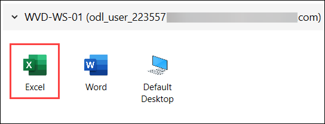
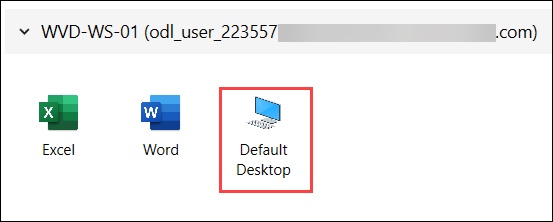

# Module 10 - Connect to WVD using the WVD client

Duration: 15 minutes

In this exercise, we will access the Desktop and RemoteApps assigned to us in the previous exercise using WVD Desktop client.  The following operating systems are supported:

Windows
- Windows 10
- Windows 10 IoT Enterprise
- Windows 7

Mac
- macOS 10.12 and later

**Additional Resources**

There are multiple clients available for you to access WVD resources. Refer to the following Docs for more information about each client:
  |              |            |  
|----------|:-------------:|
| Description | Links |
|Connect with the Windows Desktop Client |  https://docs.microsoft.com/en-us/azure/virtual-desktop/connect-windows-7-and-10 |
| Connect with the HTML5 web client |  https://docs.microsoft.com/en-us/azure/virtual-desktop/connect-web |
| Connect with the Android client | https://docs.microsoft.com/en-us/azure/virtual-desktop/connect-android |
| Connect with the macOS client |  https://docs.microsoft.com/en-us/azure/virtual-desktop/connect-macos |
| Connect with the iOS client | https://docs.microsoft.com/en-us/azure/virtual-desktop/connect-ios |
  |              |            | 

### Task 1: Access the Published Application

1. Install the application of your choice

- [Windows 64-bit](https://go.microsoft.com/fwlink/?linkid=2068602)
- [Windows 32-bit](https://go.microsoft.com/fwlink/?linkid=2098960)
- [Windows ARM64](https://go.microsoft.com/fwlink/?linkid=2098961)
- [macOS](https://apps.apple.com/app/microsoft-remote-desktop/id1295203466?mt=12) 

>**Note: The below steps assume you are utilizing the Windows 64-bit client and my vary depending on your circumstances

2. Open the application and click on **Subscribe**.

   (images/a49.png)
  
  
3. Sign in using a synchronized identity that has been assigned to an application group.

>**Note**: If you added the **AAD DC Administrators** to the groups in the previous exercises, you will be able to use your Global Administrator information.  This **must** be a user that is synchronized with the AD DS with Azure AD Connect.  To verify, go to Azure Active Directory users and verify the directory sync users.

   - Username: *Paste your username* **<inject key="AzureAdUserEmail" />** *and then click on **Next**.*
   
   

   - Password: *Paste the password* **<inject key="AzureAdUserPassword" />** *and click on **Sign in**.*

   
   
   
4. Make sure to **uncheck** *Allow my organization to manage my device* and click on **This app only**.

   

5. Select an available resource from the client. In this example we will run **Excel** 

   
   

6. Sign in using a synchronized identity that has been assigned to an application group.
   
   
   

7. Wait for your application to connect.

   
   

8. The Excel application will launch and will look similar to the screenshot below.

    
9. You can exit the sign-in window of Excel Application by clicking on close button.

   
## Task 2: Access the Virtual Desktop**

1. Run the WVD client, click on the tile named **Default Desktop** to launch the desktop.

   
   

2. Sign in using a synchronized identity that has been assigned to an application group.
   
   
   

3. Wait for your Desktop to connect.

   
   

4. Your virtual desktop will launch.

