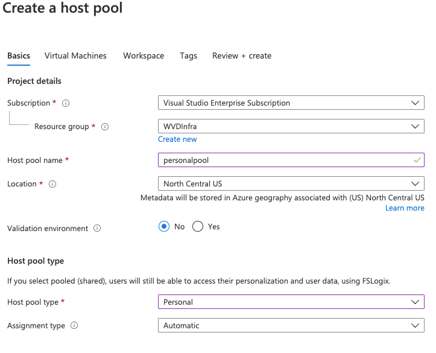
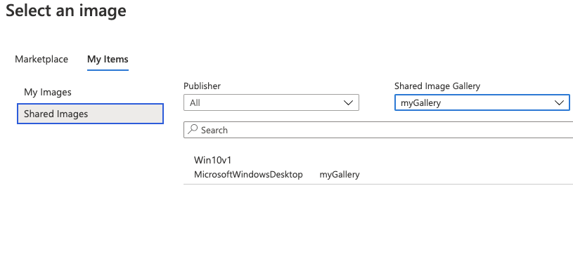
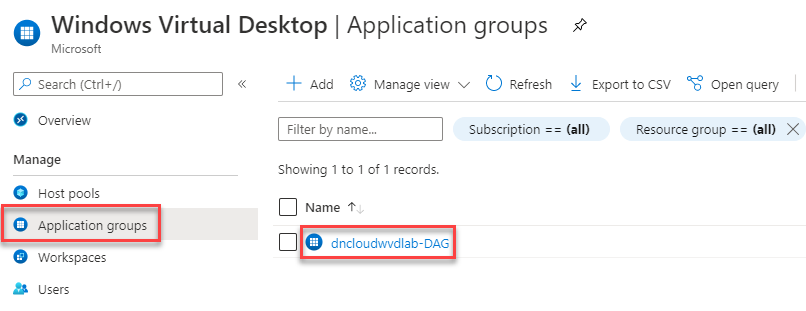
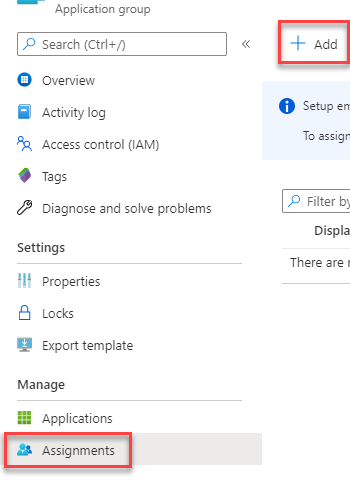
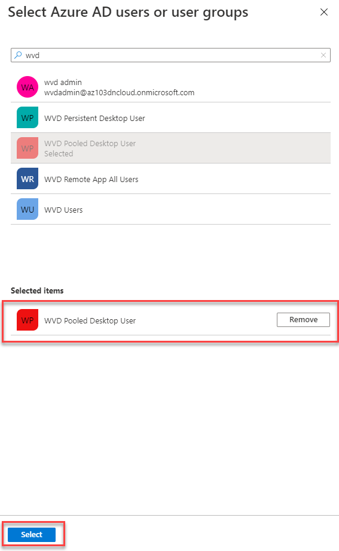
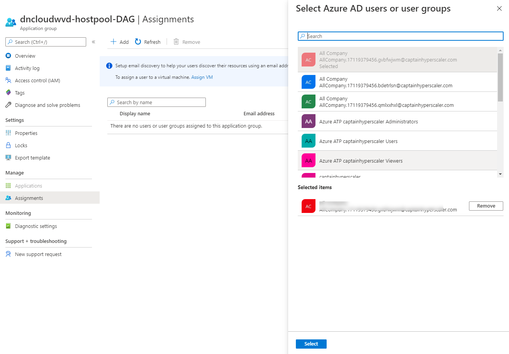

# Module 8: Create a host pool for personal desktops

Duration:  30 minutes

In this exercise we will be creating a Windows Virtual Desktop host pool for personal desktops. 

**Additional Resources**

  |              |            |  
|----------|:-------------:|
| Description | Links |
| Create a host pool with the Azure portal | https://docs.microsoft.com/en-us/azure/virtual-desktop/create-host-pools-azure-marketplace |
  |              |            | 

### Task 1: Create a new Host Pool and Workspace

1.  Sign in to the [Azure Portal](https://portal.azure.com/).

2.  Search for **Windows Virtual Desktop** and select it from the list.

        

3.  Under Manage, select **Host pools** and Select **+ Add**.
   
    

4.  On the Basics page, refer to the following screenshot to fill in the required fields. Once complete, Select **Next: Virtual Machines**.

    

5.  Select **Yes** to **Add virtual machines**  When you configure **Virtual machine settings**: 

- **Number of VMs** should be **2**

- **Virtual Network** should match the one created when demploying the domain controller template and should end with wvd1-vnet

- **Network Security Group** should be **None**

- **Vritual Machine Administrator Account** username should be **locadmin** and the password should match the other passwords used previously
   
- Select **Browse all images and disks** and then select the tab option for **My Items** then **Shared Images** to select the image that was created.

    

    

6.  On the Workspace page, select **Yes** to register a new desktop app group. Select **Create new** and provide a **Workspace name**. Select **OK** and **Review + create**.

    

7.  On the Create a host pool page, Select **Create**.

### Task 2: Create a friendly name for the workspace

The name of the Workspace is displayed when the user signs in. Available resources are organized by Workspace. For a better user experience, we will provide a friendly name for our new Workspace. 

>**Note**: The workspace will not appear until Task 1 has completed deployment. 

1.  Sign in to the [Azure Portal](https://portal.azure.com/).

2.  Search for **Windows Virtual Desktop** and select it from the list.

    

3.  Under Manage, select **Workspaces**. Locate the Workspace you want to update and Select on the name.

    

4.  Under Settings, select **Properties**.

5.  Update the **Friendly name** field to your desired name.

    

6.  Select **Save**.

    

### Task 3: Assign an Azure AD group to an application group

In the new Windows Virtual Desktop ARM portal, we now have the ability to use Azure Active Directory groups to manage access to our host pools.

1.  Sign in to the [Azure Portal](https://portal.azure.com/).

2.  Search for **Windows Virtual Desktop** and select it from the list.

    

3.  Under Manage, select **Application groups**.
    
4.  Locate the Application group that was created as part of Task 1. Select on the name.

    

5.  Under Manage, select **Assignments** and Select **+ Add**.

    

6.  In the fly out, enter **WVD** in the search to find the name of your Azure AD group. In this exercise we will select **WVD Pooled Desktop Users** and **AAD DC Administrators**.
    >**Note**: AAD DC Administrators will allow you to use your Azure tenant login to access resources in Exercise 7.

    

7.  Choose **Select** to save your changes.

    

With the assignment added, you can move on to the next exercise. The users in the Azure AD group can be used to validate access to the new host pool in a later exercise.
