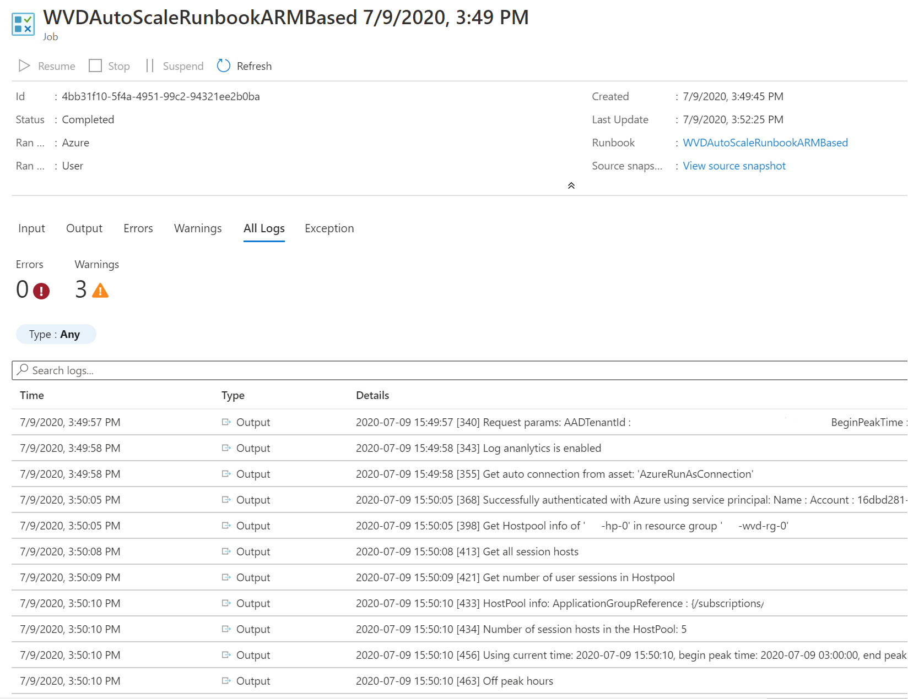

# Module 9 -  Scale session hosts using Azure Automation (Part 2)

Duration: 15 Minutes

>**Note: This exercise is a continuation of Step 7 - Scale session hosts automatically Part 1.  Please ensure you have completed those steps prior to performing these.

## Manage your scaling tool

Now that you've created your scaling tool, you can access its output. This section describes a few features you might find helpful.

### View job status

You can view a summarized status of all runbook jobs or view a more in-depth status of a specific runbook job in the Azure portal.

On the right of your selected Azure Automation account, under "Job Statistics," you can view a list of summaries of all runbook jobs. Opening the **Jobs** page on the left side of the window shows current job statuses, start times, and completion times.

>

### View logs and scaling tool output

You can view the logs of scale-out and scale-in operations by opening your runbook and selecting the job.

Navigate to the runbook in your resource group hosting the Azure Automation account and select **Overview**. On the overview page, select a job under **Recent Jobs** to view its scaling tool output, as shown in the following image.

>

### Check the runbook script version number

You can check which version of the runbook script you're using by opening the runbook file in your Azure Automation account and selecting **View**. A script for the runbook will appear on the right side of the screen. In the script, you'll see the version number in the format `v#.#.#` under the `SYNOPSIS` section. You can find the latest version number [here](https://github.com/Azure/RDS-Templates/blob/master/wvd-templates/wvd-scaling-script/ARM_based/basicScale.ps1#L1). If you don't see a version number in your runbook script, that means you're running an earlier version of the script and you should update it right away. If you need to update your runbook script, follow the instructions in Part 1.

### Log Analytics

If you decided to use Log Analytics, you can view all the log data in a custom log named **WVDTenantScale_CL** under **Custom Logs** in the **Logs** view of your Log Analytics Workspace. We've listed some sample queries you might find helpful.

- To see all logs for a host pool, enter the following query

    ```Kusto
    WVDTenantScale_CL
    | where hostpoolName_s == "<host_pool_name>"
    | project TimeStampUTC = TimeGenerated, TimeStampLocal = TimeStamp_s, HostPool = hostpoolName_s, LineNumAndMessage = logmessage_s, AADTenantId = TenantId
    ```

- To view the total number of currently running session host VMs and active user sessions in your host pool, enter the following query

    ```Kusto
    WVDTenantScale_CL
    | where logmessage_s contains "Number of running session hosts:"
         or logmessage_s contains "Number of user sessions:"
         or logmessage_s contains "Number of user sessions per Core:"
    | where hostpoolName_s == "<host_pool_name>"
    | project TimeStampUTC = TimeGenerated, TimeStampLocal = TimeStamp_s, HostPool = hostpoolName_s, LineNumAndMessage = logmessage_s, AADTenantId = TenantId
    ```

- To view the status of all session host VMs in a host pool, enter the following query

    ```Kusto
    WVDTenantScale_CL
    | where logmessage_s contains "Session host:"
    | where hostpoolName_s == "<host_pool_name>"
    | project TimeStampUTC = TimeGenerated, TimeStampLocal = TimeStamp_s, HostPool = hostpoolName_s, LineNumAndMessage = logmessage_s, AADTenantId = TenantId
    ```

- To view any errors and warnings, enter the following query

    ```Kusto
    WVDTenantScale_CL
    | where logmessage_s contains "ERROR:" or logmessage_s contains "WARN:"
    | project TimeStampUTC = TimeGenerated, TimeStampLocal = TimeStamp_s, HostPool = hostpoolName_s, LineNumAndMessage = logmessage_s, AADTenantId = TenantId
    ```
